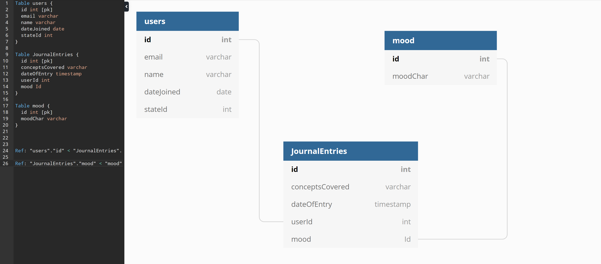

# Kaitlyn Long journal

Welcome to my daily journal where you will be able to see my everyday progress through Nashville Software School. My journal consists of different sections displaying information from current knowledge obtained.

Each day i will submit a journal entry that was created using JavaScript, HTML and CSS.

## Journal Components

My Daily Journal displays information through five components all holding different kinds of information. 

1. The first thing to do when creating a new journal entry is to submit the date using a button created through HTML.
1. After selecting the date, the next thing to do is input concepts learned for that specific day.
1. Following the concepts learned section, a Journal Entry section can be found where you descriptively type the concepts learned and knowledge obtained.
1. A mood dropdown is located after the journale entry section where you can select your current mood for the day.
1. Lastly a save button is located below all sections allowing the user to save all recorded information.

## Current Language used in journal

Located in my Daily Journal is developer language such as JavaScript, HTML and CSS. Other outside websites have been used in created my intial journal set up such as Figma for the wireframe, Canva for the logo and DBdiagram to make connections between correlating objects.

## Personas
| [dbdiagram](./images/Daily-Journal-dbdiagram.png) | 
| -- | -- | -- | -- | -- | -- | -- |
| | 

